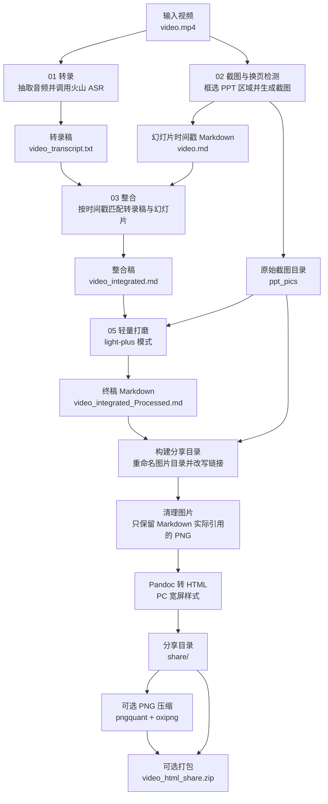

# Session Notes Maker 使用文档

这个 Skill 用来把一段演讲、课程、会议或带 PPT 的视频，自动生成一份可分享的 HTML 图文稿。最终产物包含：

- 视频转录稿
- PPT/幻灯片截图
- 幻灯片与转录稿对齐后的 Markdown
- 轻量打磨后的文章
- PC 宽屏 HTML 页面
- 只包含实际引用图片的分享目录
- 可选 zip 压缩包

本 Skill 是**可单独分发**的，所需脚本已经内置在 `scripts/` 目录中，不依赖宿主项目根目录里的 `01_transcribe_video.py`、`02_extract_slide_timestamps.py` 等文件。

---

## 处理流程总览



---

## 1. 目录结构

```text
session-notes-maker/
├── SKILL.md
├── README.md
└── scripts/
    ├── 00_build_session_notes.py
    ├── 01_transcribe_video.py
    ├── 02_extract_slide_timestamps.py
    ├── 03_integrate_transcript_slides.py
    ├── 04_polish_slide_transcript.py
    ├── markdown_llm_utils.py
    ├── 05_compress_png_images.py
    ├── config.example.py
    ├── requirements.txt
    └── .gitignore
```

核心入口是：

```bash
python ~/.cursor/skills/session-notes-maker/scripts/00_build_session_notes.py
```

---

## 2. 安装部署

### 2.1 放置 Skill

推荐作为个人 Skill 单独分发，将目录放到：

```text
~/.cursor/skills/session-notes-maker/
```

如果需要作为某个项目的项目级 Skill，也可以放到：

```text
<your-project>/.cursor/skills/session-notes-maker/
```

下文默认使用个人 Skill 路径：

```bash
python ~/.cursor/skills/session-notes-maker/scripts/00_build_session_notes.py ...
```

### 2.2 安装 Python 依赖

建议使用 Python 3.10+。在 Skill 所在环境中执行：

```bash
pip install -r ~/.cursor/skills/session-notes-maker/scripts/requirements.txt
```

`requirements.txt` 包含：

- `requests`
- `moviepy`
- `boto3`
- `botocore`
- `opencv-python`
- `scikit-image`
- `numpy`
- `Pillow`
- `openai`

### 2.3 安装系统命令

还需要以下命令行工具：

```bash
brew install ffmpeg pandoc pngquant oxipng
```

用途：

- `ffmpeg`：从视频中抽取音频，供 MoviePy 使用。
- `pandoc`：把 Markdown 转换成 standalone HTML。
- `pngquant`：压缩 PNG，但仍保持 PNG 格式。
- `oxipng`：进一步无损优化 PNG。

如果不使用 `--compress-png`，`pngquant` 和 `oxipng` 可以不装。

---

## 3. 配置文件

Skill 内置了配置模板：

```text
scripts/config.example.py
```

复制一份作为真实配置：

```bash
cp ~/.cursor/skills/session-notes-maker/scripts/config.example.py \
   ~/.cursor/skills/session-notes-maker/scripts/config.py
```

然后填写 `scripts/config.py` 中的 API Key 和服务配置。

注意：

- `scripts/config.py` 包含真实密钥，不要分享。
- `scripts/.gitignore` 已经忽略 `config.py`。
- 分发 Skill 时只应分发 `config.example.py`。

---

## 4. 需要哪些模型和服务

这条流水线依赖三类外部能力：

1. 火山引擎语音识别：把视频音频转成带时间戳的转录稿。
2. Cloudflare R2：临时托管音频文件，让火山引擎 ASR 可以通过公网 URL 拉取。
3. OpenRouter 多模态模型：读取幻灯片图片，结合转录稿做轻量打磨。

### 4.1 OpenRouter 模型

默认模型在 `scripts/config.py` 中：

```python
BASE_URL = "https://openrouter.ai/api/v1"
MODEL = "google/gemini-2.5-flash"
```

推荐默认使用：

```text
google/gemini-2.5-flash
```

原因：

- 支持图像输入，能读取幻灯片截图。
- 成本和速度相对适合批量处理。
- 用于本 Skill 的 `light-plus` 轻量打磨模式已经足够。

如果你希望更高质量，可以换成 OpenRouter 支持的其它多模态模型，但必须满足：

- 支持 image input；
- 支持中文；
- 上下文长度足够处理单页幻灯片和对应转录文本。

### 4.2 火山引擎 ASR

配置项：

```python
ACCESS_KEY = "YOUR_VOLCENGINE_ACCESS_KEY"
SUBMIT_URL = "https://openspeech.bytedance.com/api/v3/auc/bigmodel/submit"
QUERY_URL = "https://openspeech.bytedance.com/api/v3/auc/bigmodel/query"
DEFAULT_LANGUAGE = "zh"
```

脚本使用的是火山引擎大模型语音识别接口，默认中文。

### 4.3 Cloudflare R2

配置项：

```python
R2_ENDPOINT_URL = "YOUR_R2_ENDPOINT_URL"
R2_ACCESS_KEY_ID = "YOUR_R2_ACCESS_KEY_ID"
R2_SECRET_ACCESS_KEY = "YOUR_R2_SECRET_ACCESS_KEY"
R2_BUCKET_NAME = "YOUR_R2_BUCKET_NAME"
R2_PUBLIC_URL_PREFIX = "YOUR_R2_PUBLIC_URL_PREFIX"
```

R2 的作用是：

1. 本地从视频中抽取 MP3；
2. 上传 MP3 到 R2；
3. 生成公网可访问 URL；
4. 把 URL 提交给火山引擎 ASR。

---

## 5. API 怎么申请

### 5.1 申请 OpenRouter API Key

步骤：

1. 打开 OpenRouter 官网并注册账号。
2. 进入 API Keys 页面。
3. 创建一个新的 API Key。
4. 复制 key，填入：

```python
API_KEY = "YOUR_OPENROUTER_API_KEY"
```

5. 确认账号余额或额度足够。
6. 确认模型名可用，例如：

```python
MODEL = "google/gemini-2.5-flash"
```

OpenRouter 的调用方式由 `openai` Python SDK 兼容接口完成，关键配置是：

```python
BASE_URL = "https://openrouter.ai/api/v1"
API_KEY = "YOUR_OPENROUTER_API_KEY"
MODEL = "google/gemini-2.5-flash"
```

### 5.2 申请火山引擎语音识别

步骤：

1. 注册并登录火山引擎账号。
2. 开通语音识别 / 大模型语音识别相关服务。
3. 在控制台获取可调用语音识别接口的 `ACCESS_KEY`。
4. 确认账号有调用额度、计费方式和权限。
5. 将 key 填入：

```python
ACCESS_KEY = "YOUR_VOLCENGINE_ACCESS_KEY"
```

默认接口地址：

```python
SUBMIT_URL = "https://openspeech.bytedance.com/api/v3/auc/bigmodel/submit"
QUERY_URL = "https://openspeech.bytedance.com/api/v3/auc/bigmodel/query"
```

注意：

- 音频文件必须能被火山引擎通过公网 URL 访问。
- 所以本 Skill 使用 R2 托管音频文件。

### 5.3 申请 Cloudflare R2

步骤：

1. 注册并登录 Cloudflare。
2. 开通 R2 Object Storage。
3. 创建一个 Bucket，例如 `mp4`。
4. 创建 R2 API Token / Access Key。
5. 记录：

```python
R2_ENDPOINT_URL = "..."
R2_ACCESS_KEY_ID = "..."
R2_SECRET_ACCESS_KEY = "..."
R2_BUCKET_NAME = "..."
```

6. 配置 Bucket 的公网访问方式，得到可访问的 public URL 前缀：

```python
R2_PUBLIC_URL_PREFIX = "https://..."
```

7. 确认上传后的文件 URL 可以在浏览器或命令行中直接访问。

---

## 6. API 是怎么调用的

### 6.1 转录调用链路

```text
video.mp4
  -> 抽取 audio.mp3
  -> 上传到 Cloudflare R2
  -> 得到 public audio URL
  -> 调用火山引擎 submit API
  -> 轮询 query API
  -> 写出 <video>_transcript.txt
```

对应脚本：

```text
scripts/01_transcribe_video.py
```

### 6.2 图片理解和文字打磨调用链路

```text
每一页幻灯片截图 + 对应转录文本
  -> OpenRouter chat/completions 兼容接口
  -> google/gemini-2.5-flash
  -> 生成轻量打磨后的段落
```

对应脚本：

```text
scripts/04_polish_slide_transcript.py
scripts/markdown_llm_utils.py
```

本 Skill 固定使用 `light-plus` 模式：

- 以转录稿为主体；
- 幻灯片只用于纠错、补充必要上下文；
- 不做大幅重写；
- 最终 HTML 不包含 prompt 附录。

---

## 7. 使用方法

### 7.1 第一次处理单个视频

如果还没有 PPT 截图区域配置，建议使用交互模式：

```bash
python ~/.cursor/skills/session-notes-maker/scripts/00_build_session_notes.py \
  "/path/to/video.mp4" \
  --interactive \
  --zip
```

交互窗口中：

1. 用鼠标框选 PPT 区域；
2. 按 Enter 或空格确认；
3. 脚本会保存 `<video>.ppt_rect.json`，下次可复用。

### 7.2 使用已有截图区域

如果视频旁边已有：

```text
<video>.ppt_rect.json
```

可以直接运行：

```bash
python ~/.cursor/skills/session-notes-maker/scripts/00_build_session_notes.py \
  "/path/to/video.mp4" \
  --zip
```

### 7.3 显式指定截图区域

如果已知相对坐标：

```bash
python ~/.cursor/skills/session-notes-maker/scripts/00_build_session_notes.py \
  "/path/to/video.mp4" \
  --ppt-rect "0.0359,0.0806,0.6792,0.7296" \
  --zip
```

### 7.4 压缩 PNG 后打包

如果需要保持 PNG 格式但压缩体积：

```bash
python ~/.cursor/skills/session-notes-maker/scripts/00_build_session_notes.py \
  "/path/to/video.mp4" \
  --ppt-rect "0.0359,0.0806,0.6792,0.7296" \
  --compress-png \
  --zip
```

---

## 8. 输出结果

默认输出目录：

```text
<video_parent>/<video_stem>_html_output/
```

结构：

```text
<video_stem>_html_output/
├── work/
│   ├── <video_stem>.md
│   ├── <video_stem>_integrated.md
│   ├── <video_stem>_integrated_Processed.md
│   └── ppt_pics/
├── share/
│   ├── <video_stem>.html
│   ├── <video_stem>.md
│   └── <video_stem>_ppt_pics/
└── <video_stem>_html_share.zip
```

其中最适合分享的是：

```text
<video_stem>_html_output/<video_stem>_html_share.zip
```

如果不打包，则分享整个 `share/` 目录。

---

## 9. 常见问题

### 9.1 HTML 打开后图片不显示

检查：

- HTML 是否和 `<video_stem>_ppt_pics/` 在同一个 `share/` 目录；
- 图片目录是否被一起复制；
- 文件路径中是否被手动改名。

runner 会在结束前检查 `` 引用是否都能找到。

### 9.2 转录失败

常见原因：

- 火山引擎 `ACCESS_KEY` 不正确；
- R2 上传失败；
- R2 public URL 无法公网访问；
- 音频太长或服务额度不足。

### 9.3 OpenRouter 调用失败

检查：

- `API_KEY` 是否有效；
- 账号是否有余额；
- `MODEL` 是否支持图片输入；
- 网络是否能访问 OpenRouter。

### 9.4 图片压缩后仍然很大

使用：

```bash
--compress-png
```

它会用 `pngquant` + `oxipng` 压缩 PNG，仍保持 `.png` 格式。对于幻灯片截图，通常可以显著降低体积。

---

## 10. 安全提醒

不要把以下文件提交或分发给别人：

```text
scripts/config.py
```

可以安全分发：

```text
scripts/config.example.py
```

真实 key 只应保存在本机或受信任的部署环境中。
